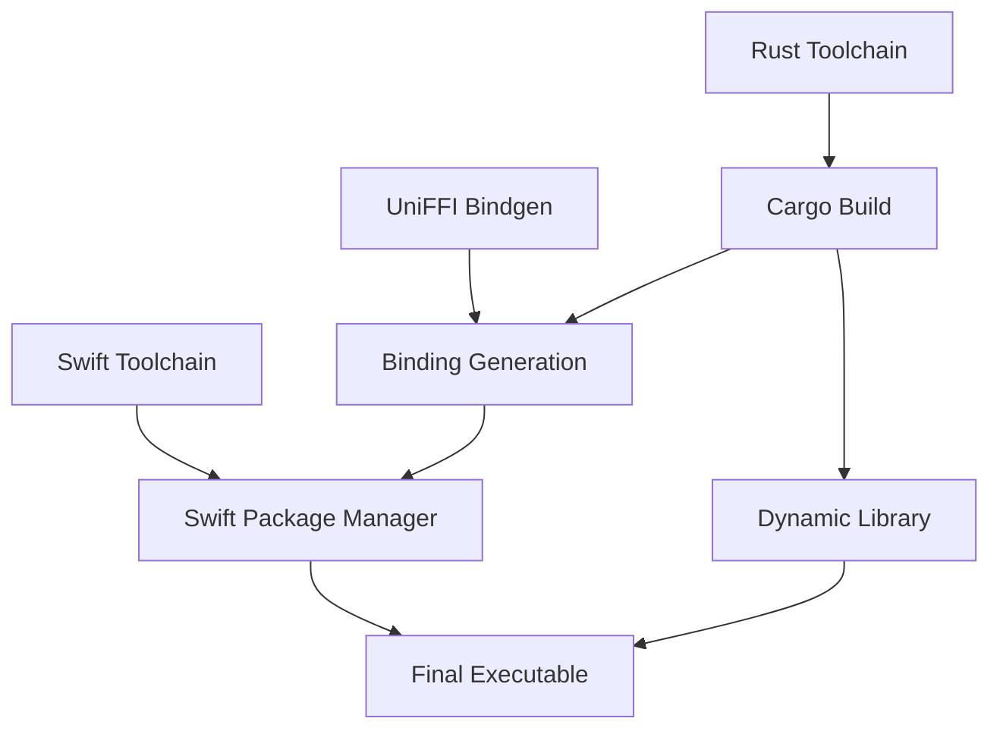

# CI/CD Guide - Rem TUI

Comprehensive guide for Continuous Integration and Continuous Deployment of the Rem Apple Reminders TUI application.

## Table of Contents

- [Overview](#overview)
- [GitHub Actions Workflows](#github-actions-workflows)
- [Build Process](#build-process)
- [Testing Strategy](#testing-strategy)
- [Release Process](#release-process)
- [Local Development](#local-development)
- [Troubleshooting](#troubleshooting)

## Overview

Rem TUI uses GitHub Actions for automated CI/CD with three main workflows:

1. **CI Pipeline** (`ci.yml`) - Runs on every push/PR for continuous integration
2. **Release Pipeline** (`release.yml`) - Runs on version tags for automated releases
3. **Local Development** - Makefile targets for development workflow

### Architecture Requirements

The build system must handle:
- **Rust Core**: Cargo-based compilation with UniFFI bindings
- **Swift Integration**: Native macOS EventKit integration
- **UniFFI Bridge**: Type-safe cross-language communication
- **macOS-specific**: EventKit APIs require macOS runner

## GitHub Actions Workflows

### Continuous Integration (ci.yml)

**Triggers**: 
- Push to `main` branch
- Pull requests to `main`

**Jobs**:

#### 1. Build Job
```yaml
build:
  name: Build macOS
  runs-on: macos-latest
```

**Steps**:
1. **Checkout** - Get source code
2. **Setup Rust** - Install Rust toolchain with rustfmt/clippy
3. **Cache Dependencies** - Cache Rust registry and build artifacts
4. **Code Quality** - Check Rust formatting and linting
5. **Install UniFFI** - Install UniFFI bindgen tool
6. **Build Rust Core** - Compile Rust library
7. **Generate Bindings** - Create Swift bindings with UniFFI
8. **Build Swift** - Compile Swift package and executable
9. **Upload Artifacts** - Store build outputs for testing

#### 2. Test Job
```yaml
test:
  name: Test macOS
  runs-on: macos-latest
  needs: build
```

**Steps**:
1. **Setup Environment** - Checkout and setup Rust
2. **Cache Dependencies** - Reuse cached artifacts
3. **Install UniFFI** - Install binding generator
4. **Build for Testing** - Full build with test configuration
5. **Run Rust Tests** - Execute Rust core test suite
6. **Run Swift Tests** - Execute Swift package tests

#### 3. Quality Job
```yaml
quality:
  name: Code Quality
  runs-on: macos-latest
```

**Steps**:
1. **Setup Environment** - Checkout and setup Rust with tools
2. **Cache Dependencies** - Reuse cached artifacts
3. **Install UniFFI** - Install binding generator
4. **Quality Checks** - Run comprehensive code quality checks

### Release Pipeline (release.yml)

**Triggers**: 
- Push of version tags matching `v*` (e.g., `v1.0.0`)

**Jobs**:

#### 1. Build Release Job
```yaml
build:
  name: Build Release
  runs-on: macos-latest
```

**Steps**:
1. **Checkout** - Get tagged source code
2. **Setup Rust** - Install stable Rust toolchain
3. **Cache Dependencies** - Cache for faster builds
4. **Install UniFFI** - Install binding generator
5. **Build Release** - Full release build
6. **Package Distribution** - Create distribution package
7. **Create Tarball** - Package as `rem-tui-macos.tar.gz`
8. **Upload Artifacts** - Store for release job

#### 2. GitHub Release Job
```yaml
release:
  name: Create GitHub Release
  runs-on: ubuntu-latest
  needs: build
```

**Steps**:
1. **Checkout** - Get source for release notes
2. **Download Artifacts** - Get build outputs
3. **Extract Version** - Parse version from Git tag
4. **Create Release** - Create GitHub release with assets

## Build Process

### Build Dependencies



### Build Steps in Detail

#### 1. Rust Core Build
```bash
# Location: rust-core/
cd rust-core
cargo build --release
```

**Output**: `target/release/librem_core.dylib`

**Key Features**:
- Ratatui-based TUI implementation
- UniFFI-compatible function exports
- Comprehensive error handling
- Performance-optimized release build

#### 2. UniFFI Binding Generation
```bash
# Generate Swift bindings from UDL
cargo run --bin uniffi-bindgen generate src/rem_core.udl --language swift --out-dir ../RemTUIKit/Sources/RemTUIKit/
```

**Outputs**:
- `rem_core.swift` - Swift wrapper functions
- `rem_coreFFI.h` - C header for FFI
- `rem_coreFFI.modulemap` - Module map

**Generated Interface**:
```swift
// Example generated function
public func startTui(lists: [ReminderList]) throws -> [TuiAction] {
    // Generated implementation
}
```

#### 3. Swift Package Build
```bash
# Build Swift package with Rust library
cd RemTUIKit
swift build -c release -Xswiftc -I. -Xlinker -L. -Xlinker -lrem_core
```

**Features**:
- Native EventKit integration
- Permission management
- Async/await data loading
- Error handling with context

#### 4. Swift Executable Build
```bash
# Build final executable
cd RemTUI
swift build -c release
```

**Output**: `RemTUI/.build/release/RemTUI`

### Build Optimization

#### Caching Strategy
```yaml
- name: Cache Rust dependencies
  uses: actions/cache@v3
  with:
    path: |
      ~/.cargo/registry
      ~/.cargo/git
      rust-core/target
    key: ${{ runner.os }}-cargo-${{ hashFiles('**/Cargo.lock') }}
```

**Benefits**:
- Faster builds (5-10x speedup)
- Reduced CI minutes usage
- More predictable build times

#### Parallel Building
- Rust compilation uses all available cores
- Swift compilation leverages parallelism
- Jobs run concurrently where possible

## Testing Strategy

### Test Layers

```
Testing Pyramid:
├── Unit Tests (Fast, Isolated)
│   ├── Rust Core Logic Tests
│   ├── Swift Service Tests
│   └── Data Structure Tests
├── Integration Tests (Medium, Component)
│   ├── UniFFI Interface Tests
│   ├── Swift-Rust Communication
│   └── Permission Flow Tests
└── System Tests (Slow, End-to-End)
    ├── Full Application Tests
    └── Performance Validation
```

### Test Execution

#### Rust Tests
```bash
# In CI and locally
cd rust-core
cargo test --locked --all-features
```

**Test Categories**:
- TUI component tests
- Data structure validation
- Error handling verification
- Performance benchmarks

#### Swift Tests
```bash
# Swift package tests
cd RemTUIKit
swift test

# Executable build test
cd RemTUI
swift build
```

**Test Categories**:
- EventKit integration tests
- Permission manager tests
- Async operation tests
- Error handling tests

#### Integration Tests
```bash
# Full build validation
make build
make test
```

**Validation**:
- UniFFI binding generation
- Cross-language data transfer
- End-to-end application flow
- Performance characteristics

### Test Quality Gates

#### Code Coverage
- Rust: Built-in `cargo test` coverage
- Swift: XCTest framework coverage
- Integration: End-to-end scenario coverage

#### Performance Tests
```bash
# Automated performance validation
make benchmark
```

**Metrics**:
- Cold start time < 1 second
- List loading < 500ms
- Memory usage < 50MB
- CPU usage reasonable

## Release Process

### Version Tagging

#### Creating a Release
```bash
# 1. Update version in relevant files
# 2. Commit changes
git commit -m "chore: bump version to v1.2.0"

# 3. Create and push tag
git tag v1.2.0
git push origin v1.2.0
```

#### Automatic Trigger
- GitHub Actions detects `v*` tag
- Triggers release workflow automatically
- Builds and publishes release assets

### Release Artifacts

#### Distribution Package
```
rem-tui-macos.tar.gz
├── rem-tui              # Main executable
└── librem_core.dylib   # Rust core library
```

#### Installation Instructions
```bash
# User installation steps
1. Download rem-tui-macos.tar.gz
2. tar -xzf rem-tui-macos.tar.gz
3. mv rem-tui /usr/local/bin/
4. chmod +x /usr/local/bin/rem-tui
```

### Release Notes

Automatic generation includes:
- Version information
- Installation instructions
- System requirements
- Basic usage guide
- Link to commit history

### GitHub Release UI

The release appears in GitHub's releases section with:
- Release title: "Rem TUI v1.2.0"
- Downloadable assets
- Release notes
- Version tag reference

## Local Development

### Development Workflow

#### Quick Start
```bash
# Setup environment
make setup

# Start development mode
make dev
# Watches files and auto-rebuilds
```

#### Manual Build Steps
```bash
# Step-by-step build
make build-rust         # Build Rust core
make build-uniffi       # Generate bindings
make build-swift        # Build Swift components

# Or build everything
make build
```

#### Testing Locally
```bash
# Run all tests
make test

# Individual test suites
make test-rust          # Rust tests only
make test-swift         # Swift tests only

# Quality checks
make check              # All quality checks
make fmt                # Format code
make lint               # Run linters
```

### Development Tools

#### File Watching
```bash
# Auto-rebuild on changes
make dev

# Swift-only development (preserves checksums)
make dev-swift
```

#### Debugging
```bash
# Debug modes
make debug              # Debug build and run
make debug-rust         # Debug Rust components
make debug-swift        # Debug Swift components
make debug-build        # Debug build process
```

#### Performance Testing
```bash
# Local performance validation
make benchmark          # Performance metrics
make profile            # Profiling setup
```

### CI/CD Simulation

#### Local CI Pipeline
```bash
# Run the same checks as CI
make ci

# Individual CI steps
make check              # Code quality
make test               # All tests
make build              # Full build
```

#### Pre-commit Validation
```bash
# Before pushing changes
make fmt                # Format code
make check              # Quality checks
make test               # Run tests
make build              # Verify build
```

## Troubleshooting

### Common CI Issues

#### Build Failures

**Rust Compilation Errors**
```bash
# Check locally
cd rust-core
cargo check
cargo clippy --all-targets --all-features -- -D warnings
```

**Swift Compilation Errors**
```bash
# Check locally
cd RemTUIKit
swift build
cd ../RemTUI
swift build
```

**UniFFI Binding Issues**
```bash
# Regenerate bindings
make clean
make build-uniffi
```

#### Cache Issues

**Stale Cache**
- Clear GitHub Actions cache in repository settings
- Or change cache key in workflow

**Local Cache**
```bash
# Clear local caches
make clean-all
cargo clean
```

#### Permission Issues

**macOS Runner Permissions**
- GitHub Actions macOS runners have limited permissions
- Some system-level tests may not work in CI
- Use mocking for permission-sensitive tests

### Debugging CI Failures

#### Action Logs
1. Go to GitHub Actions tab
2. Click on failed workflow
3. Expand failed job/step
4. Check detailed logs

#### Local Reproduction
```bash
# Reproduce CI environment locally
make ci

# Debug specific component
make debug-rust
make debug-swift
make debug-build
```

#### Common Solutions

**Dependency Issues**
```bash
# Update dependencies
cd rust-core
cargo update

# Check for conflicts
cargo tree
```

**Version Conflicts**
```bash
# Check Rust version
rustc --version

# Check Swift version
swift --version
```

### Performance Issues

#### Slow Builds
- Check cache hit rates
- Optimize dependency graph
- Use parallel builds where possible

#### Test Timeouts
- Increase timeout values
- Optimize test performance
- Use test parallelization

## Best Practices

### Workflow Optimization

1. **Use Caching Effectively**
   - Cache Rust dependencies
   - Cache build artifacts
   - Use appropriate cache keys

2. **Parallel Execution**
   - Run independent jobs in parallel
   - Use matrix builds for multiple configurations
   - Optimize build ordering

3. **Fail Fast**
   - Run quick checks first
   - Fail early on code quality issues
   - Use appropriate timeouts

### Security Considerations

1. **Token Security**
   - Use `GITHUB_TOKEN` for releases
   - Limit token permissions
   - No hardcoded secrets

2. **Dependency Security**
   - Regular dependency updates
   - Security scanning
   - Pin versions appropriately

### Monitoring

1. **Build Metrics**
   - Track build times
   - Monitor cache hit rates
   - Watch for performance regressions

2. **Quality Metrics**
   - Test coverage trends
   - Code quality metrics
   - Performance benchmarks

---

This CI/CD guide provides comprehensive documentation for the automated build, test, and release processes of Rem TUI. For additional questions or improvements, please refer to the GitHub repository or create an issue.